# Phospherus Blog System

## 📝 Introduction

Phospherus is a blog system that contains admin system and blog homepage, it's built with golang and react.

> The degree of completion of thie project is not high engouh, so there are many potential problems or imperfections.
> But I think it's helpful to learn how to build a web project with golang and react, and how to deploy a web project with docker.

## 🛠 Tech Stack

- backend:
    - golang
    - gin
    - gorm
    - jwt
    - viper
    - mysql
    - aliyun-oss
- frontend:
    - typescript
    - react
    - react-router
    - tailwindcss
    - zustand
    - antd
    - react-markdown

## 🎨 Preview

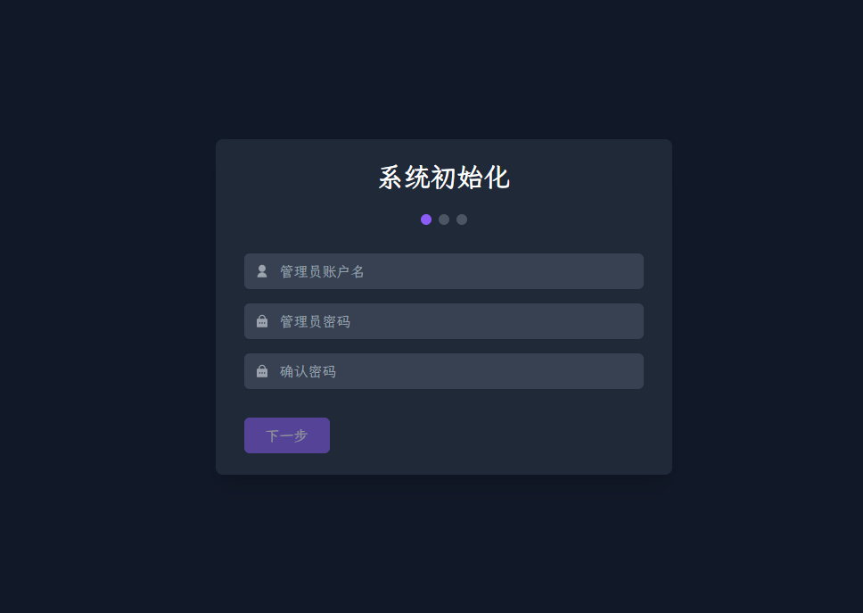

### console endpoint

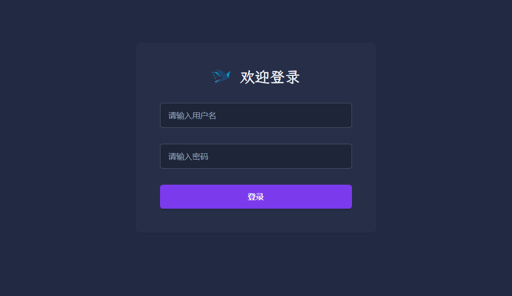

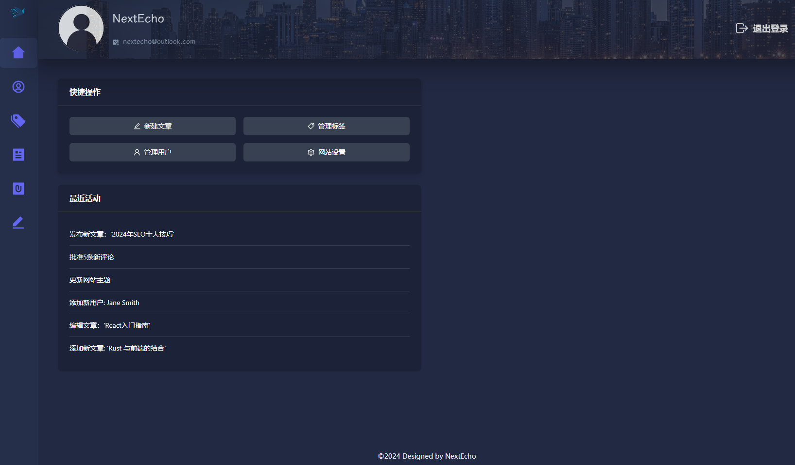

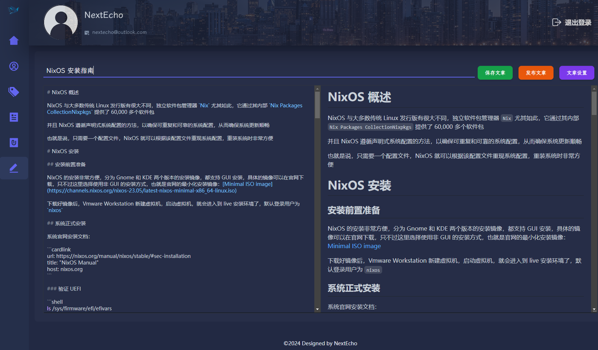

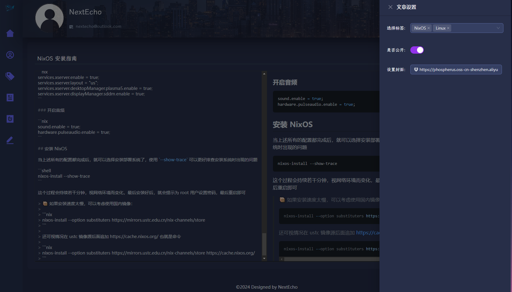

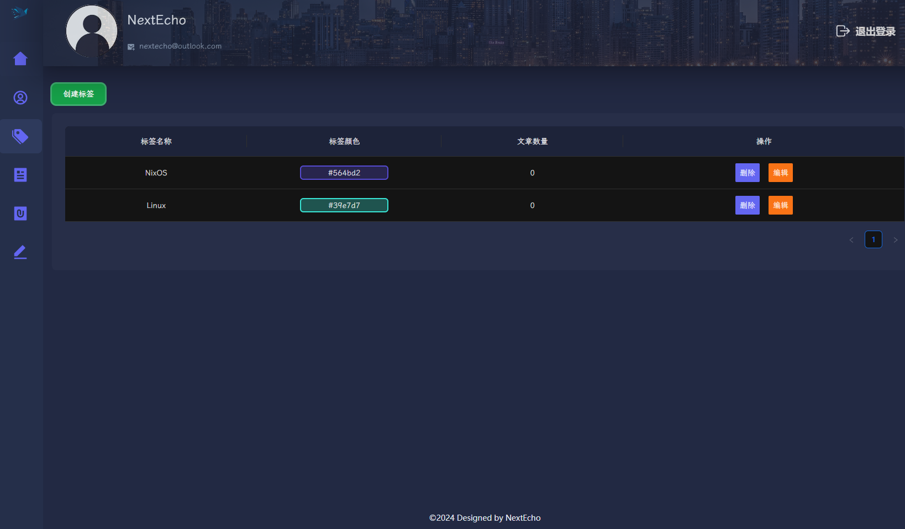

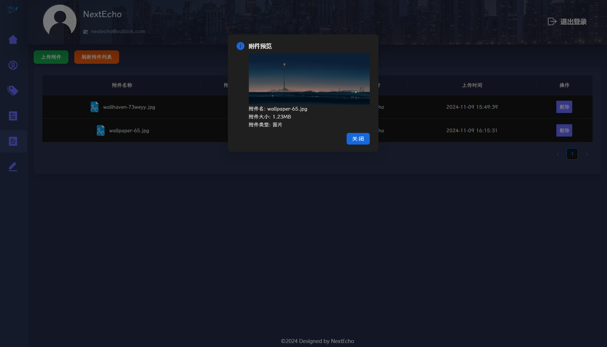

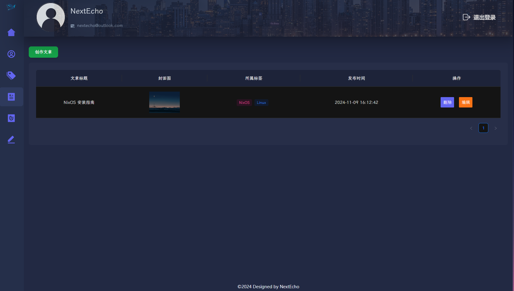

### blog endpoint

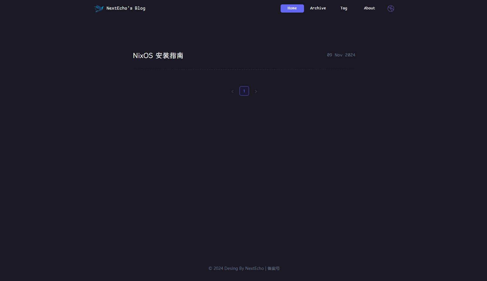

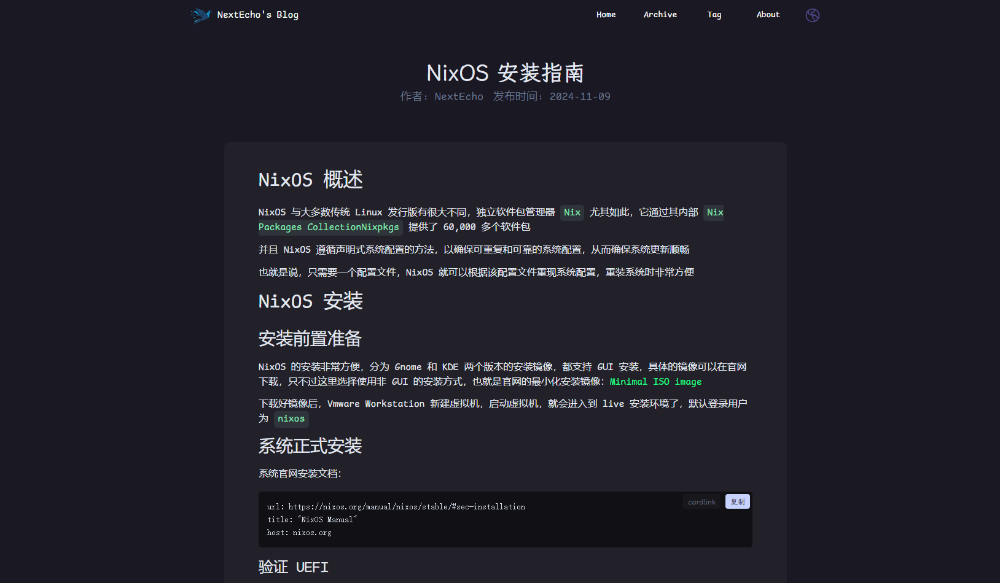

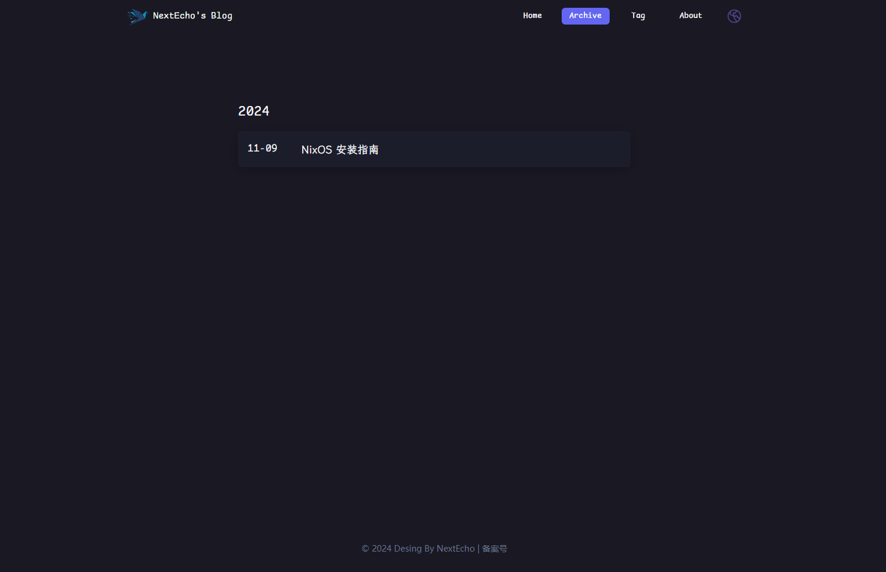

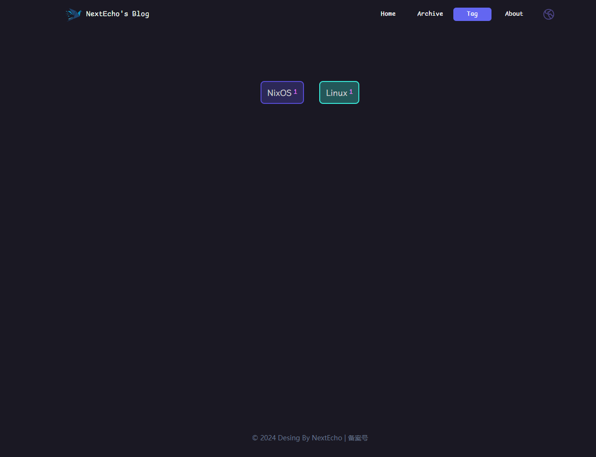

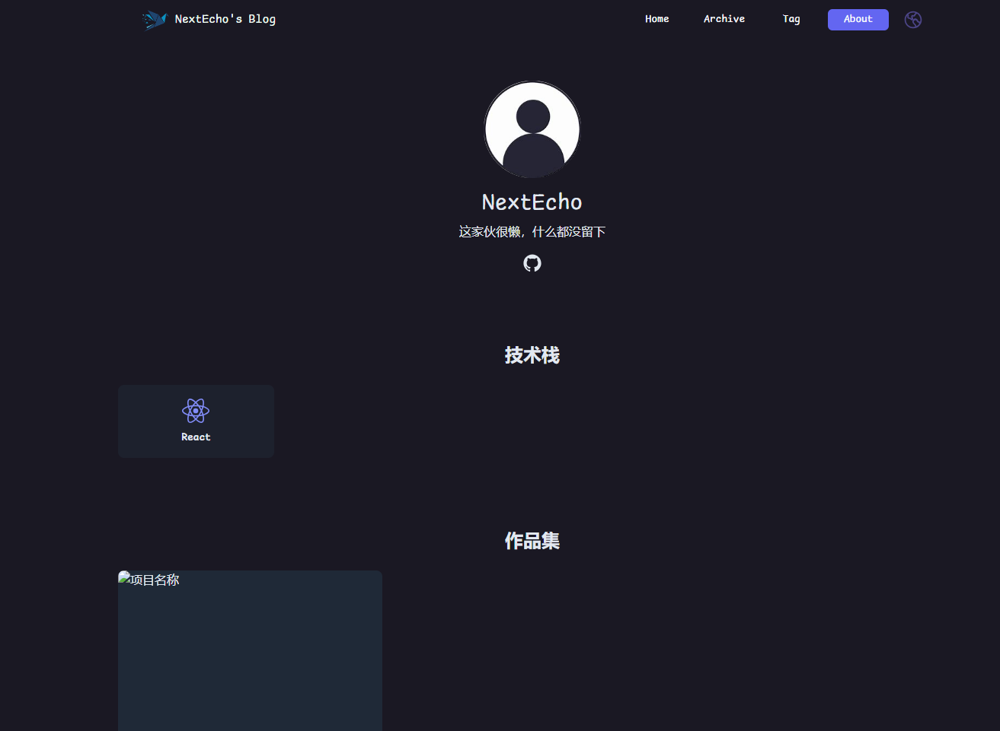

## 🚀 Local running project

If you want to run this project in your local machine, you need to prepare following environment:

- mysql:8.4
- nodejs 18+
- golang:1.22+
- pnpm: `npm install -g pnpm`

### Run server

Modify `Phospherus/backend/etc/config-dev.yml` config file, change mysql and oss config

```shell
# change mysql config 
mysql:
  host: "127.0.0.1"
  port: 3306
  dbname: ""
  user: ""
  password: ""
  max_open_conns: 200
  max_idle_conns: 50

# fill your aliyun oss secretKey
oss:
  accessKey: ""
  secretKey: ""
  endpoint: ""
  bucket: ""
```

Run server

```shell
cd Phospherus/backend
go run .
```

### Run frontend

```shell
cd Phospherus/frontend/blog
pnpm run dev

cd Phospherus/frontend/console
pnpm run dev
```

- `127.0.0.1:9000` for console
- `127.0.0.1:10000` for blog homepage

## 💻 Project Deployment

### Step 1

Clone source code to local.

```shell
git clone https://github.com/n1nelink/Phospherus.git
```

### Step 2

You should modify `Phospherus/backend/etc/config-prod.yml` config file if you want to deploy this project on your local machine

Modify mysql and oss config

```shell
# change mysql config 
mysql:
  host: "phospherus-db"
  port: 3306
  dbname: ""
  user: ""
  password: ""
  max_open_conns: 200
  max_idle_conns: 50

# fill your aliyun oss secretKey
oss:
  accessKey: ""
  secretKey: ""
  endpoint: ""
  bucket: ""
```

### Step 3

Go to the project root directory.

```shell
cd Phospherus
```

Execute the command `docker compose` to build and run the container group.

```bash
docker compose up -d
```

After docker build, you can access `127.0.0.1:9000` to enter the Phospherus admin system, and access `127.0.0.1:10000` to enter the blog homepage.
